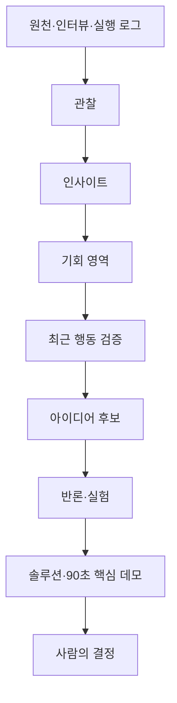

# 21세기 집현전

2026 세종 AX 해커톤을 위한 인사이트·기획·검증·개발 협업 저장소입니다.

이 저장소의 목표는 첫 아이디어를 빠르게 확정하는 것이 아닙니다. 세종의 구체 문제와 해커톤 제약에서 재사용 가능한 인사이트를 만들고, 그 인사이트를 거슬러 올라갈 수 있는 아이디어만 비교해 8월 11일까지 시연 가능한 AI 서비스로 좁히는 것입니다.

## 현재 상태

**메인 아이디어는 아직 선택되지 않았습니다.**

- 현재 단계: 인사이트 초안 합성 완료·사람 승인 전 → 기회 영역 비교
- 1차 비교 영역: 정시 무차량 이동, 문화 수요 기반 콘텐츠 실행, 대형행사 분산 귀가
- 기존 `회동(會同)`은 `IDEA-001`, `seed` 상태의 아이디어 메모
- 회동의 상세 문제·고객 가설은 seed 기록에만 남고, 이전 솔루션은 archived, 메인 문제·고객·PRD 정본은 선택 전까지 비어 있음
- 메인 아이디어는 실제 행동 검증, 독립 반론, 같은 기준 비교, 제품 책임자의 D-ID 결정 후에만 선택

## 먼저 읽을 문서

1. [AI 협업 지침](AGENTS.md)
2. [문서 색인](docs/DOCUMENT_INDEX.md)
3. [현재 상태](docs/00_overview/CURRENT_STATUS.md)
4. [게이트 판정 기록](docs/07_decisions/GATE_LOG.md)
5. [인사이트 원장](docs/00_overview/INSIGHT_LEDGER.md)
6. [기회 영역 지도](docs/00_overview/OPPORTUNITY_MAP.md)
7. [아이디어 포트폴리오](docs/03_solution/IDEA_PORTFOLIO.md)
8. [솔루션 포트폴리오](docs/03_solution/SOLUTION_PORTFOLIO.md)
9. [AI 에이전트 프레임워크](docs/08_ai/AGENT_FRAMEWORK.md)
10. [AI 에이전트 작업 큐](docs/08_ai/AGENT_TASK_QUEUE.md)
11. [검증 근거](docs/04_validation/EVIDENCE_LOG.md)
12. [해커톤 실행 계획](docs/06_delivery/HACKATHON_PLAN.md)

## 근거에서 결정까지

AI는 각 단계를 보조하지만 게이트를 건너뛰거나 메인 아이디어를 자동 선택하지 않습니다.

## 현재까지 정리된 핵심 인사이트

- 세종 문제의 반복 원형은 정보 부족보다 마감시각이 있는 상황의 조정 실패입니다.
- 대표 사건 하나를 끝까지 처리해야 하며 넓은 통합 플랫폼은 피합니다.
- 세종 특화는 UI가 아니라 데이터·생활권·업무 구조가 판단을 바꾸는 것입니다.
- AI는 추천 문장이 아니라 다음 행동에 쓰는 계획·배정·신청·승인 결과물을 남겨야 합니다.
- 멀티에이전트는 캐릭터 수가 아니라 독립 책임·도구·검증 기준이 있을 때만 사용합니다.
- 기술 조사 자료는 계약·권한·검증·복구에 사용하고 고객 문제의 증거로 쓰지 않습니다.

## 협업 원칙

- 문서 ID별 정본 하나만 유지합니다.
- 사실, 관찰, 인사이트, 가설, 제안, 결정, 검증 결과를 구분합니다.
- 핵심 계보 `RS/E/SJ-P → OBS → IN → OPP → IDEA → SOL → D`를 추적할 수 있어야 합니다.
- OPP·IDEA·SOL의 치명 가설 `HYP`는 상태 승격 전에 근거 `E` 또는 실험 `X`로 검증합니다.
- 주요 고객, 핵심 문제, 선택 아이디어, P0 범위 변경은 결정 기록을 남깁니다.
- main에 직접 작업하지 않고 작은 브랜치와 Pull Request로 협업합니다.
- AI는 제안·패치·테스트 근거까지 만들고 병합·배포·외부 제출은 사람이 승인합니다.

## 저장소 구조

| 경로 | 용도 |
|---|---|
| docs/00_overview | 현재 상태, 인사이트, 기회 영역 |
| docs/01_problem | 선택 전 빈 문제 정본 |
| docs/02_customer | 선택 전 빈 주요 고객 정본 |
| docs/03_solution | seed·아이디어·후보별 최소 솔루션 포트폴리오와 보관 기록 |
| docs/04_validation | 원천 목록, 인터뷰·자료·실험 근거 |
| docs/05_product | 선택 후보의 PRD와 수용 기준 |
| docs/06_delivery | 게이트, 일정, 데모, 발표 |
| docs/07_decisions | 사람의 결정과 변경 이유 |
| docs/08_ai | 에이전트 프레임워크, 작업 큐, 프롬프트 |
| templates | 인사이트·기회·아이디어·실험·결정 양식 |
| .github | Issue와 Pull Request 양식 |

## 바로 시작하기

1. `AR-003`으로 OPP-001–003의 48시간 검증 우선순위를 비교합니다.
2. 제품 책임자가 추천한 두 영역을 승인하고 해당하는 `AR-004–006` 두 작업만 차단 해제합니다.
3. Gate 2를 통과한 상위 두 영역에서만 아이디어를 생성합니다.
4. 독립 반론과 최소 프로토타입으로 치명 가정을 확인합니다.
5. 제품 책임자가 D-ID로 메인 아이디어를 선택합니다.
6. 선택된 후보에 맞춰 문제·고객·솔루션·PRD·일정 정본을 한 PR에서 갱신합니다.

Pull Request에서는 `node scripts/validate-planning-docs.mjs`가 문서 ID·색인·템플릿·선택 상태·게이트 판정의 구조적 모순을 검사합니다. 이 검사는 근거의 진실성이나 사람의 판단까지 자동 보증하지 않습니다.
