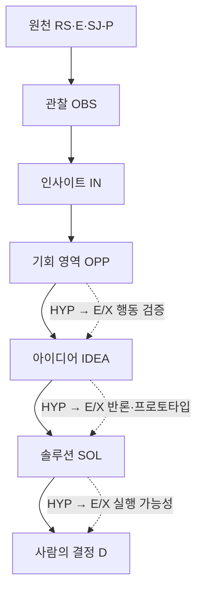

# 인사이트 원장

이 문서는 메인 아이디어를 선택하기 전에 팀이 합의할 **설계 제약과 기회 판단 기준**의 정본입니다. 인사이트는 아이디어가 아니며, 특정 솔루션을 정당화하기 위해 사후에 만드는 문장도 아닙니다.

## 인사이트가 되는 조건

관찰은 원천에서 확인한 사실 또는 주장입니다. 인사이트는 하나 이상의 관찰을 해석해 앞으로의 선택을 바꾸는 문장입니다. 설계·기술 인사이트는 한 OBS 안에 서로 다른 원천 위치가 둘 이상 연결될 수 있습니다. 고객 패턴은 문제은행 합성만으로 `active`가 되지 않으며 최근 직접 행동 검증 전에는 `qualified`를 유지합니다.

인사이트 하나에는 반드시 다음이 있어야 합니다.

- 원천 또는 문제 ID
- 무엇을 관찰했는지
- 어떤 선택을 바꾸는지
- 어떤 실패를 막는지
- 반박될 조건
- 신뢰도와 상태

상태는 `proposed`, `active`, `qualified`, `rejected`, `superseded` 중 하나를 사용합니다. 이 상태는 AI 비교에 사용할 수 있는 작업 상태이며 사람의 Gate 1 판정과 다릅니다.

## 근거 흐름

핵심 계보 `RS/E/SJ-P → OBS → IN → OPP → IDEA → SOL → D`가 끊긴 결과는 정본으로 승격하지 않습니다. OPP·IDEA·SOL의 치명 가설 `HYP`는 각각 최근 행동 근거 `E` 또는 사전 기준을 고정한 실험 `X`로 검증합니다.

## 유형

- `design-principle`: 아이디어·제품 선택 방식에 적용하는 해커톤 설계 원칙
- `customer-pattern`: 문제은행에서 발견한 고객 문제 패턴. 직접 행동 검증 전에는 qualified
- `technical-constraint`: 솔루션 선택 후 구현·에이전트 운영에 적용하는 기술 제약
- `research-guardrail`: 근거 해석과 조사 품질을 통제하는 규칙

## 인사이트 목록

| ID | 유형 | 관찰 | 인사이트 | 선택에 미치는 영향 | 상태 | 신뢰 |
|---|---|---|---|---|---|---|
| IN-001 | design-principle | OBS-001 | 아이디어의 최소 단위는 넓은 플랫폼이 아니라 **구체 고객이 특정 상황에서 겪는 대표 사건 하나**다. | 고객·상황·실패 행동·손실·결과물이 모호하면 보류한다. | active | 높음 |
| IN-002 | design-principle | OBS-002 | 세종 특화는 이름·세계관이 아니라 **세종의 데이터나 생활권·업무 구조가 판단 결과를 바꾸는 것**이다. | 세종 요소 제거 테스트를 적용한다. | active | 높음 |
| IN-003 | design-principle | OBS-003 | 아이디어 선택은 취향이 아니라 **같은 기준 비교와 치명 가정의 실험**이다. | 최대 3개 기회를 같은 표로 비교한다. | active | 높음 |
| IN-004 | design-principle | OBS-004 | **사용자·수혜자·구매자·운영자·도입 결정자**를 분리해야 한다. | 역할 지도와 파일럿 책임자를 요구한다. | active | 높음 |
| IN-005 | design-principle | OBS-005 | 데이터는 **추가됐을 때 판단이나 행동이 달라질 때만** 가치가 있다. | 바꾸는 결정·시점·권리·결측 처리를 연결한다. | active | 높음 |
| IN-006 | design-principle | OBS-006 | AI는 답변보다 **다음 사람이 바로 쓰는 업무 결과물**을 남겨야 한다. | 이벤트→판단→결과물→다음 행동이 없는 후보를 재검토한다. | active | 높음 |
| IN-007 | design-principle | OBS-007 | 자동화 수준은 모델 자신감이 아니라 **오류 피해 비용**으로 정한다. | 자동 실행·사람 승인·정보 부족 중단으로 분류한다. | active | 높음 |
| IN-008 | design-principle | OBS-008 | 기대효과는 **기준값·계산식·비교군·시간·비용·오류율**로 증명한다. | 전후 지표와 측정법이 없는 아이디어는 보류한다. | active | 높음 |
| IN-009 | design-principle | OBS-009 | 책임 있는 AI는 **근거·시점·불확실성·수정·감사 로그와 실패 실험**으로 보여야 한다. | 상위 위험과 이의제기 경로를 설계한다. | active | 높음 |
| IN-010 | design-principle | OBS-010 | **두 번째 사용 사건과 정보 갱신 순환**이 있어야 한다. | 재사용 트리거와 기여 편익을 요구한다. | active | 중상 |
| IN-011 | design-principle | OBS-011 | 시연 가능성은 **3분 발표 안의 90초 핵심 데모**로 선정 단계에서 검사한다. | 입력 전후 상태 변화가 보이지 않으면 보류한다. | active | 높음 |
| IN-012 | technical-constraint | OBS-012 | 작은 팀은 도구 수보다 **하나의 계약·작은 PR·자동 검증·재실행 가능한 핵심 경로**가 중요하다. | 구현 후보의 계약과 검증 계획에만 적용한다. | active | 높음 |
| IN-013 | technical-constraint | OBS-013 | 성공 응답이 아니라 **사후 상태 재조회와 실제 경로 테스트**가 완료 증거다. | post-condition과 검증 산출물을 요구한다. | active | 높음 |
| IN-014 | technical-constraint | OBS-014 | 에이전트는 **호출·재시도·시간·토큰·비용·권한**의 유한한 예산 안에서 동작한다. | 작업 봉투에 상한과 승인 행동을 명시한다. | active | 높음 |
| IN-015 | customer-pattern | OBS-015 | 문제은행에는 정보 부재보다 **마감시각이 있는 상황의 조정 실패**가 반복된다. | 추천 목록보다 제약 검증·대안 비교를 우선 검토한다. | qualified | 중상 |
| IN-016 | customer-pattern | OBS-016 | 현재 표본에서는 **정시 도착이 필요한 무차량 이동**의 고통·반복성이 강하다. | 이동 영역을 검증 우선 후보로 두되 표본 편향을 검사한다. | qualified | 중간 |
| IN-017 | customer-pattern | OBS-017 | 자격·정보 분산의 가치는 번역이 아니라 **조건→서류→기관→기한→다음 행동** 연결에 있다. | 단순 RAG보다 완료 경로를 검토한다. | qualified | 중상 |
| IN-018 | design-principle | OBS-018 | AI는 공급을 만들지 못하므로 **예측·수요 집계·우선순위·대체안 연결**까지만 약속한다. | 구조적 공급 부족과 해결 가능 부분을 분리한다. | active | 높음 |
| IN-019 | technical-constraint | OBS-019 | 멀티에이전트는 캐릭터 수가 아니라 **독립 책임·도구·검증 기준**이 있을 때만 쓴다. | 검색·요약은 단일 흐름을 우선한다. | active | 높음 |
| IN-020 | research-guardrail | OBS-020 | 대학생 고객 접근성·공감은 **조사 효율이지 문제 강도의 증거가 아니다.** | 모든 고객 후보에 같은 행동 기준을 적용한다. | active | 높음 |

## 인사이트 검토 기록

현재 상태와 신뢰도는 AI 합성·교차 감사 결과이며 사람의 Gate 1 승인이 아닙니다. 사람 검토가 끝날 때까지 `governance.gate-log`의 Gate 1은 `partial`입니다.

| 인사이트 ID | 현재 판정자 | 판정일 | 사람 검토자 | 개별 Gate 1 판정·공백 |
|---|---|---|---|---|
| IN-001 | AI synthesis | 2026-07-24 | 미지정 | pending |
| IN-002 | AI synthesis | 2026-07-24 | 미지정 | pending |
| IN-003 | AI synthesis | 2026-07-24 | 미지정 | pending |
| IN-004 | AI synthesis | 2026-07-24 | 미지정 | pending |
| IN-005 | AI synthesis | 2026-07-24 | 미지정 | pending |
| IN-006 | AI synthesis | 2026-07-24 | 미지정 | pending |
| IN-007 | AI synthesis | 2026-07-24 | 미지정 | pending |
| IN-008 | AI synthesis | 2026-07-24 | 미지정 | pending |
| IN-009 | AI synthesis | 2026-07-24 | 미지정 | pending |
| IN-010 | AI synthesis | 2026-07-24 | 미지정 | pending |
| IN-011 | AI synthesis | 2026-07-24 | 미지정 | pending |
| IN-012 | AI synthesis | 2026-07-24 | 미지정 | pending |
| IN-013 | AI synthesis | 2026-07-24 | 미지정 | pending |
| IN-014 | AI synthesis | 2026-07-24 | 미지정 | pending |
| IN-015 | AI synthesis | 2026-07-24 | 미지정 | pending; customer behavior required |
| IN-016 | AI synthesis | 2026-07-24 | 미지정 | pending; customer behavior required |
| IN-017 | AI synthesis | 2026-07-24 | 미지정 | pending; customer behavior required |
| IN-018 | AI synthesis | 2026-07-24 | 미지정 | pending |
| IN-019 | AI synthesis | 2026-07-24 | 미지정 | pending |
| IN-020 | AI synthesis | 2026-07-24 | 미지정 | pending |

## 관찰 등록부

| 관찰 ID | 확인한 관찰 | 원천 | 한계 |
|---|---|---|---|
| OBS-001 | 다수 전략이 넓은 플랫폼보다 대표 사건 하나의 end-to-end 해결을 반복 강조한다. | RS-STR-001 §2·5·7, RS-STR-002 §40, RS-STR-006 §104·110·111 | 수상 전략이지 특정 고객 증거는 아님 |
| OBS-002 | 세종·대회 요소를 제거해도 결과가 같으면 주제 적합성이 약하다는 패턴이 반복된다. | RS-STR-001 §3, RS-STR-002 §27·29, RS-STR-006 §101·103 | 타 대회 사례 포함 |
| OBS-003 | 아이디어 동결 전 동일 기준 비교와 치명 가정 실험이 반복 권고된다. | RS-STR-001 §1·4–6, RS-STR-005 §81–83 | 구체 시간 수치는 휴리스틱 |
| OBS-004 | 공공·사업화 사례는 사용자 외 구매·운영·도입 역할 부재를 위험으로 지적한다. | RS-STR-002 §21·34·35, RS-STR-005 §87·98 | B2G 예시 편향 |
| OBS-005 | 데이터·모달리티는 실제 판단을 바꿀 때만 의미가 있고 시점·권리·결측 질문이 반복된다. | RS-STR-002 §29·30, RS-STR-005 §85·86·97, RS-STR-006 §113·120 | 실제 API 접근성은 별도 확인 필요 |
| OBS-006 | 최근 전략은 답변 생성보다 다음 사람이 이어 쓰는 결과물을 강하게 평가한다. | RS-STR-002 §31, RS-STR-006 §104·110 | 사용자 행동 검증 필요 |
| OBS-007 | 고위험 행동은 사람 승인, 근거 충돌은 중단하도록 분기하는 원칙이 반복된다. | RS-STR-004 §72–74, RS-STR-006 §105·106 | 위험도 기준은 도메인별 조정 |
| OBS-008 | 효과·비용 주장은 기준값과 비교 없이는 심사·사업화 근거가 약하다. | RS-STR-001 §6·17·19, RS-STR-002 §32, RS-STR-005 §96·99 | 공개 비용 사례 재검증 필요 |
| OBS-009 | 설명·근거·감사 로그와 실패 공격 테스트가 책임 있는 AI의 증거로 반복된다. | RS-STR-001 §19, RS-STR-004 §71–74, RS-STR-006 §105–108 | 타 대회 평가 기준 포함 |
| OBS-010 | 일회성 체험을 피하려면 재사용 사건과 갱신·기여 순환이 필요하다는 주장이 반복된다. | RS-STR-002 §26·28·33, RS-STR-005 §84·89 | 실제 재사용률은 미검증 |
| OBS-011 | 수상·실패 회고는 짧은 시간 안의 상태 변화와 장애 fallback을 핵심으로 본다. | RS-STR-001 §7·12·14–15, RS-STR-004 §68–70·76, RS-STR-005 §81·94–95 | 발표 형식은 공식 공고 재확인 |
| OBS-012 | 기술 조사 전반에서 계약·작은 PR·자동 검증·재실행 가능한 수직 경로가 반복된다. | RS-BE-001–010, RS-STR-001 §9, RS-STR-005 §100 | 고객 가치 증거가 아님 |
| OBS-013 | tool call·배포 상태·HTTP 200만으로 완료·정합성을 판단하면 안 된다는 실패 패턴이 반복된다. | RS-BE-001–010 | 공식 문서·실제 테스트로 재검증 |
| OBS-014 | 에이전트의 call·retry·token·time·cost·permission 상한 필요성이 반복된다. | RS-BE-005–010, RS-STR-005 §99–100 | 숫자 상한은 과업별 설정 |
| OBS-015 | 29개 문제 중 다수에서 등교·출근·진료·돌봄 종료·행사 종료 등 마감시각과 희소 자원 조정이 함께 나타난다. | SJ-P-0001–0007, 0013–0015, 0018–0020, 0025–0026, 0029 | 교통 중심 검색 편향 |
| OBS-016 | 현재 문제은행에서 이동 관련 문제 수와 손실이 두드러지고 일부는 교차 원천을 가진다. | SJ-P-0005·0006·0026, 0001·0002·0004·0014 | 시민 전체 발생률로 일반화 불가 |
| OBS-017 | 자격·창구·정보 분산 사례는 사용자가 다음 행동 경로를 완성하지 못하는 형태로 기록된다. | SJ-P-0008·0009·0016–0018·0024 | 최근 행동 인터뷰 부족 |
| OBS-018 | 다수 문제의 원인은 실제 버스·의료진·돌봄·시설 공급 부족이며 SW가 공급 자체를 만들 수 없다. | RS-PB-001, SJ-P-0004·0005·0015·0019·0022 | 조정으로 줄일 수 있는 손실은 별도 실험 필요 |
| OBS-019 | 복수 제약·정책·데이터를 다루는 문제에는 역할 분리가 자연스럽지만 검색·요약 문제는 단일 흐름으로 충분하다. | SJ-P-0001·0002·0004–0007·0016–0018·0025·0026, RS-STR-001 §18 | 실제 멀티에이전트 우위는 미검증 |
| OBS-020 | IDEA-001의 출발점은 미검증 HYP-001이며 최근 실패 행동·손실·대안 실패가 아직 없다. | HYP-001 | HYP-001은 근거가 아니며 인터뷰 전 상태 |

## 현재의 긴장 관계

| 긴장 | 통합 원칙 |
|---|---|
| 세종 특화 vs 타 지역 확장 | 세종 데이터·흐름이 결과를 바꾸되 엔진과 지역 어댑터를 분리한다. |
| 빠른 동결 vs 피벗 | 치명 가정과 독립 반론까지 확인한 뒤 문제를 동결하고 이후에는 범위를 줄인다. |
| 실제 데이터 vs 합성 데이터 | 대표 정상 경로는 실제 증거를 쓰고, 민감·위험·장애 경로는 명시한 합성 데이터로 시연한다. |
| 행동형 AI vs 사람 승인 | 저위험은 실행하고 고위험은 승인받으며 근거 충돌 시 중단한다. |
| 멀티 관점 표현 vs 단순 구현 | 사용자 결정을 실제로 바꾸는 독립 책임이 있을 때만 역할을 분리한다. |
| 심각한 공공문제 vs 검증 접근성 | 중요도와 검증 접근성을 따로 점수화하고 어느 하나를 다른 하나로 대체하지 않는다. |

## 아직 인사이트로 승격하지 않은 주장

- 특정 숫자형 운영법: 20분 과제, 40% rough complete, 65% 동결, 3시간 체크포인트, 10회 반복
- 공개 정보만으로 만든 경쟁팀 주제 밀도
- 복수 AI 모델의 모의 심사 결과
- Shorts 기반 API 비용 사례
- 타 대회의 참가 자격·AI 공개·오프라인 실행 규정
- 안전 100%, 일반 품질 90%, fixture 20개 같은 초기 품질 수치

이 항목은 참고 휴리스틱이며 세종 AX 공식 규정이나 실제 팀 측정값으로 확인되기 전 결정 근거로 사용하지 않습니다.

## 갱신 규칙

1. 새 원천을 `validation.research-source-catalog`에 먼저 등록합니다.
2. 원문에서 확인한 문장을 관찰 ID로 기록합니다.
3. 기존 인사이트와 의미 중복을 검사합니다.
4. 지지 근거와 반박 근거를 함께 연결합니다.
5. 새 근거가 기존 인사이트의 범위를 줄이면 `qualified`, 뒤집으면 `rejected` 또는 `superseded`로 바꿉니다.
6. 아이디어를 살리기 위해 인사이트의 문구나 신뢰도를 임의로 바꾸지 않습니다.
