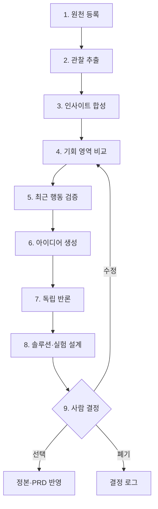

# 인사이트 기반 AI 에이전트 프레임워크

## 목적

AI가 아이디어를 많이 내는 데서 끝나지 않고, 검증된 인사이트에서 출발해 기회 영역을 좁히고 아이디어를 반박하며 시연 가능한 솔루션과 실험으로 연결하도록 합니다.

AI는 조사·분해·비교·초안·검증을 수행합니다. 메인 아이디어 선택, 고위험 행동, 비용·권한 확대, 정본 승격은 사람이 결정합니다.

## 운영 원칙

1. **인사이트 우선**: 아이디어보다 `planning.insight-ledger`를 먼저 읽습니다.
2. **한 단계 한 산출물**: 한 번의 실행에서 여러 상태를 건너뛰지 않습니다.
3. **근거 사슬**: 모든 결과는 핵심 계보 `RS/E/SJ-P → OBS → IN → OPP → IDEA → SOL → D`와 상태 승격 검증 `HYP → E/X`를 유지합니다.
4. **독립 반론**: 아이디어 생성 세션과 반론·평가 세션을 분리합니다.
5. **제한된 발산**: Gate 2를 통과한 두 기회 영역에서 영역별 최대 2개 아이디어만 생성하고, 독립 반론 후 비교 후보를 최대 3개로 줄입니다.
6. **실제 검증 우선**: 모델 간 합의는 인터뷰·공식 원문·실행 로그를 대신하지 않습니다.
7. **사후 상태 확인**: 파일 수정·API 호출·배포는 성공 응답이 아니라 재조회와 테스트로 완료를 증명합니다.
8. **가역성**: AI는 기본적으로 제안·브랜치·PR·테스트 근거까지 만들고 병합·배포·외부 발송은 사람이 승인합니다.

## 4인 팀용 운영 모드

프레임워크의 역할은 직함이 아니라 **서로 다른 검토 관점**입니다. 매번 9개의 에이전트를 모두 실행하지 않습니다.

### Fast lane — 일상 작업

읽기 전용 비교, 오탈자, 설명 보완처럼 상태·근거·게이트·고객·문제·P0를 바꾸지 않는 작업에만 사용합니다.

1. `repo.ai-instructions`의 요약 규칙, `planning.current-status`, 작업 대상 문서만 읽습니다.
2. 담당자 한 명이 작은 변경 또는 비교 결과를 만듭니다.
3. 실행 ID와 검증 결과를 Issue 또는 PR 중 한 곳에 기록합니다.

Fast lane에는 독립 Red Team이 필수가 아닙니다. 작업 중 상태·근거·게이트·고객·문제·P0 변경 필요가 발견되면 멈추고 Full gate로 전환합니다.

### Full gate — 방향을 바꾸는 작업

다음 경우에만 전체 단계와 독립 역할을 사용합니다.

- 새 메인 아이디어 선택
- 주요 고객·핵심 문제·P0 변경
- 인사이트·근거 추가 또는 상태 승격
- Gate 판정과 큐 상태 변경
- 개인정보·의료·아동·대외 행동이 포함된 설계
- 핵심 데이터·API·비용 구조 변경
- main 병합·배포·기관 제출 전

### Spike — 기술 위험만 확인

제품 선택 전 기술 실험이 필요하면 `가설 하나 + 시간 상한 + 폐기 조건 + 검증 산출물`만 둡니다. spike 결과는 고객 가치 점수를 올리지 않으며 제품 코드로 자동 승격하지 않습니다.

## 상태 흐름



## ID 체계

| 유형 | 형식 | 정본 |
|---|---|---|
| 원천 | RS-XXX-NNN | validation.research-source-catalog |
| 검증 근거 | E-NNN | validation.evidence-log |
| 세종 문제 | SJ-P-NNNN | 외부 정본 sejong-ax.problem-bank |
| 관찰 | OBS-NNN | planning.insight-ledger |
| 인사이트 | IN-NNN | planning.insight-ledger |
| 기회 영역 | OPP-NNN | planning.opportunity-map |
| 아이디어 | IDEA-NNN | planning.idea-portfolio |
| 문제·고객 가설 | HYP-NNN | planning.idea-portfolio; 선택 후 문제·고객 정본 |
| 비교 솔루션 | SOL-NNN | planning.solution-portfolio; 선택 후 planning.solution-brief |
| 실험 | X-NNN | validation.evidence-log 등록부; 실행 시 experiment.X-NNN 카드 또는 Issue |
| 에이전트 실행 | AR-NNN | ai.agent-task-queue와 실행 기록 |
| 결정 | D-NNN | governance.decision-log |

기존 ID를 재사용하거나 의미를 바꾸지 않습니다. 삭제 대신 상태를 변경합니다. 현재 `planning.solution-brief`의 SOL-001은 Gate 도입 전 legacy archive이며 새 비교 SOL은 `planning.solution-portfolio`에서 시작합니다.

## 컨텍스트 팩

모든 작업은 아래 네 문서와 작업 대상만 먼저 읽습니다.

1. `repo.ai-instructions`
2. `repo.document-index`
3. `planning.current-status`
4. `governance.gate-log`

Full gate 작업은 단계에 맞춰 `planning.insight-ledger`, `planning.opportunity-map`, `validation.evidence-log`, `governance.gate-log`, `governance.decision-log`를 추가합니다. 원천 분석은 `validation.research-source-catalog`, 아이디어 작업은 `planning.idea-portfolio`, 솔루션 작업은 `planning.solution-portfolio`도 읽습니다. 관련 없는 정본 전체를 관성적으로 읽지 않습니다.

## 작업 봉투

오케스트레이터는 실행 전에 아래 입력을 고정합니다.

```yaml
run_id: AR-NNN
stage: source|insight|opportunity|evidence|idea|red-team|solution|experiment|audit|decision
question: "이번 실행이 답할 질문 하나"
input_ids: [IN-001, OPP-001]
allowed_paths: []
forbidden_actions:
  - merge
  - deploy
  - external_message
budget:
  max_tool_calls: 20
  max_retries_per_action: 2
  deadline_minutes: 30
  max_candidates: 3
required_output:
  - conclusion
  - evidence_trace
  - counterevidence
  - proposed_change
  - verification
  - human_decision
```

값은 과업에 맞게 줄일 수 있습니다. 상한을 늘리거나 금지 행동을 해제하려면 제품 책임자의 승인이 필요합니다.

## 역할별 계약

### 1. Source Curator — 원천 정리자

입력:

- 새 파일·URL·인터뷰·실행 로그
- validation.research-source-catalog

출력:

- 중복 여부
- 직접 확인한 주장
- 원천 유형·날짜·한계
- 관찰 후보

금지:

- 제목·설명만 보고 세부 내용을 확정
- 자료 수를 근거 강도로 사용
- 고객 증거와 기술 자료를 혼합

완료 증거:

- 원천 ID, 검사 범위, 중복 결과, 인용 가능한 주장과 한계

### 2. Insight Synthesizer — 인사이트 합성자

입력:

- 관찰 2개 이상
- 기존 인사이트 전체

출력:

- 의미 중복 검사
- 새 인사이트 또는 기존 인사이트 보강·한정 제안
- 선택에 미치는 영향
- 반박될 조건

금지:

- 표현만 바꾼 새 인사이트
- 특정 아이디어를 살리기 위한 사후 논리
- 기술 조사로 고객 고통을 증명

완료 증거:

- 연결 원천·관찰, 반박 근거, 신뢰도 변경 이유

### 3. Opportunity Mapper — 기회 구조화자

입력:

- 활성 인사이트
- 문제 ID
- 검증 접근성과 해커톤 제약

출력:

- 고객·상황·실패 행동·손실
- 구조적 원인과 해결 가능한 부분
- 사용자·수혜자·구매자·운영자·도입 결정자
- 치명 가정과 48시간 검증

금지:

- 솔루션 기능부터 작성
- 공급 부족을 정보 문제로 축소
- 접근성을 문제 강도로 대체

완료 증거:

- opportunity gate 체크 결과

### 4. Ideator — 제한 발산자

입력:

- Gate 2를 통과한 기회 ID 하나
- 연결 인사이트
- 데이터·시간·기술 제한

출력:

- 기회 영역당 최대 2개 아이디어 카드
- 각 아이디어의 독립된 해결 원리
- 3분 발표 안의 90초 핵심 데모 상태 변화
- 48시간 반증 실험

금지:

- 이름만 다른 유사 아이디어
- “AI가 추천한다”로 해결 원리 대체
- 근거 없는 기능 추가

완료 증거:

- 아이디어 진입 조건 8개와 근거 사슬

### 5. Red Team — 반론자

입력:

- 아이디어 카드
- 원천·인사이트·기회 정본
- 즉시 탈락 조건

출력:

- 잘못 연결된 근거
- 가장 강한 기존 대안
- 데이터·권리·안전·도입 반례
- 실패시킬 최소 실험
- 유지·수정·폐기 추천과 확신도

금지:

- 대안 없는 비판
- 모델의 개인 취향을 고객 근거처럼 사용
- 생성자와 같은 세션의 자기검토만으로 통과

완료 증거:

- 치명 주장별 source trace와 반증 방법

### 6. Solution Architect — 솔루션 설계자

입력:

- 반론을 통과한 비교 아이디어 최대 3개
- 해커톤 기간·가용 제작 역량·데이터 경계

출력:

- 후보마다 같은 깊이의 대표 사건 end-to-end 경로
- P0·P1·제외 범위
- 이벤트·판단·도구·결과물
- 자동 실행·사람 승인·중단 경계
- 데이터·API·LLM 출력 계약
- 실패·결측·오프라인 축소 모드

금지:

- P0에 완전 자율 멀티에이전트 추가
- 확인되지 않은 API를 핵심 경로로 확정
- mock을 실제 연동처럼 표시

완료 증거:

- `planning.solution-portfolio`의 후보별 SOL 카드
- 후보별 수용 기준, 구조화 출력 검증, 핵심 경로 smoke 계획
- `governance.gate-log`의 후보별 Gate 4 판정

### 7. Experiment Designer — 검증 설계자

입력:

- 치명 가설
- 현재 기준값

출력:

- 실행 전 성공·실패·보류 기준
- 표본과 과제
- 수집 데이터와 예외
- 결과가 바꿀 문서

금지:

- 결과를 본 뒤 기준 변경
- 호감도 질문을 실제 행동 증거로 대체
- 모델 평가만으로 고객 실험 통과

완료 증거:

- X-ID가 있는 실험 카드와 담당자·기한

### 8. Judge — 동일 조건 평가자

입력:

- 최대 3개 후보
- 같은 평가표와 같은 데이터·시간 조건

출력:

- 축별 점수와 직접 근거
- 탈락 조건
- 점수 민감도와 불확실성
- 사람에게 남길 선택 질문

금지:

- 총점만으로 자동 선택
- 서로 다른 정보량의 후보를 그대로 비교
- 심사위원 역할극을 실제 심사 결과로 표현

완료 증거:

- 각 점수의 IN·OPP·E·X 연결

### 9. Orchestrator — 실행 관리자

입력:

- ai.agent-task-queue
- 현재 문서 상태

출력:

- 이번 실행의 작업 봉투
- 역할별 독립 결과
- 충돌 목록
- 정본 변경 제안
- 사람의 결정 요청

금지:

- 게이트 건너뛰기
- 여러 에이전트 결과를 다수결로 사실화
- 정본 자동 병합

완료 증거:

- 실행 보고서, diff, 검증 결과, 남은 위험

## 게이트

게이트 상태는 `pending`, `partial`, `passed`, `blocked`, `waived` 중 하나를 사용하며 판정 정본은 `governance.gate-log`입니다. `passed`와 `waived`는 사람 검토자·검토일이 필요하고, `waived`는 이유·완화책·만료일이 추가로 필요합니다.

### Gate 0 — 원천 위생

- 원문을 직접 읽었는가?
- 날짜·유형·한계를 기록했는가?
- 기존 원천·주장과 중복을 확인했는가?

### Gate 1 — 인사이트 승인

- 원천과 관찰 ID가 연결됐는가?
- design-principle·technical-constraint·research-guardrail은 OBS 안에 서로 다른 원천 위치가 둘 이상 연결됐는가?
- customer-pattern은 최근 직접 행동 근거가 추가되기 전 `qualified`를 유지하는가?
- 앞으로의 선택을 실제로 바꾸는가?
- 반박될 조건이 있는가?
- 기존 인사이트와 의미가 겹치지 않는가?
- customer-pattern은 최근 실제 행동 검증 전 `qualified`로 유지했는가?

### Gate 2 — 기회 영역 승인

- 기회를 지지하는 인사이트의 개별 Gate 1 판정이 `passed` 또는 `waived`인가?
- 고객 속성·장소·촉발 시각·실패 행동이 구체적인가?
- 대상 고객의 최근 실제 행동 또는 동등한 직접 관찰이 3건 이상 있는가?
- 기존 대안과 실패 지점이 있는가?
- 시간·비용·오류·포기 중 측정 가능한 손실이 있는가?
- AI가 해결 가능한 부분과 구조적 공급 부족을 나눴는가?
- AI가 바꾸는 판단 또는 업무 결과물이 있는가?
- 최소 데이터와 결측·오류 처리가 정의됐는가?
- 3분 발표 안의 90초 핵심 데모 상태 변화가 있는가?
- 치명 가정과 사전 성공·실패 기준을 가진 48시간 실험이 등록됐는가?

### Gate 3 — 아이디어 등록

- planning.idea-portfolio의 진입 조건 8개를 충족하는가?
- 현재 퍼널에서 기회 영역당 최대 2개로 제한했는가?
- 즉시 탈락 조건에 해당하지 않는가?

### Gate 4 — 솔루션 구체화

- 대표 사건 하나가 end-to-end로 끝나는가?
- P0가 순수 제작시간 안에 가능한가?
- 데이터·AI·사람의 책임 경계가 있는가?
- 실패 시 축소 모드가 있는가?

### Gate 5 — 선택

- 비교 후보의 최소 솔루션이 Gate 4를 통과했는가?
- 치명 가정을 실제 행동·공식 원문·프로토타입으로 검증했는가?
- 같은 기준으로 후보를 비교했는가?
- 제품 책임자가 D-ID로 결정했는가?

## 에이전트 결과 형식

모든 실행은 아래 형식을 사용합니다.

1. 실행 ID와 질문
2. 결론
3. 근거 사슬
4. 반박 근거·한계
5. 생성 또는 변경 제안
6. 실행한 검증과 사후 상태
7. 실패·부분 성공·예산 사용
8. 사람의 결정이 필요한 항목
9. 수정할 문서 ID

## 안전·권한 경계

AI가 사람 승인 없이 할 수 있는 일:

- 저장소 읽기와 비교
- 조사·초안·코드 패치
- 로컬 테스트와 검증
- 별도 브랜치와 draft PR 제안

사람 승인 후에만 할 수 있는 일:

- main 병합과 운영 배포
- 외부 메시지·메일·기관 제출
- 실제 개인정보나 민감정보 사용
- 비용 상한·권한·외부 전송 범위 확대
- 데이터 마이그레이션과 비가역 변경
- 메인 아이디어 `selected` 승격

## 기술 검증 파이프라인

LLM 출력은 한 번에 신뢰하지 않습니다.

`parse → schema → business rule → source/time → safety → budget → post-condition`

- 형식 통과와 내용의 진실성은 별도로 검사합니다.
- 외부 데이터에는 source URL, source timestamp, fetched time, schema version, stale/fallback 상태를 남깁니다.
- timeout, 429, malformed output, stale data, DB 예외, client cancellation을 핵심 경로 fixture로 준비합니다.
- 새 도구는 해결할 실패, 도입 비용, 제거 조건, fallback이 있을 때만 추가합니다.

## 현재 실행 방법

1. `ai.agent-task-queue`에서 상태가 `ready`인 AR-ID를 고릅니다.
2. 해당 행의 입력 ID와 완료 조건으로 작업 봉투를 만듭니다.
3. 독립성이 필요한 역할은 별도 세션·에이전트로 실행합니다.
4. 결과를 실행 기록 템플릿에 남깁니다.
5. 정본 변경은 작은 브랜치와 draft PR로 제안합니다.
6. 제품 책임자가 결정한 뒤 관련 정본과 결정 로그를 함께 갱신합니다.
